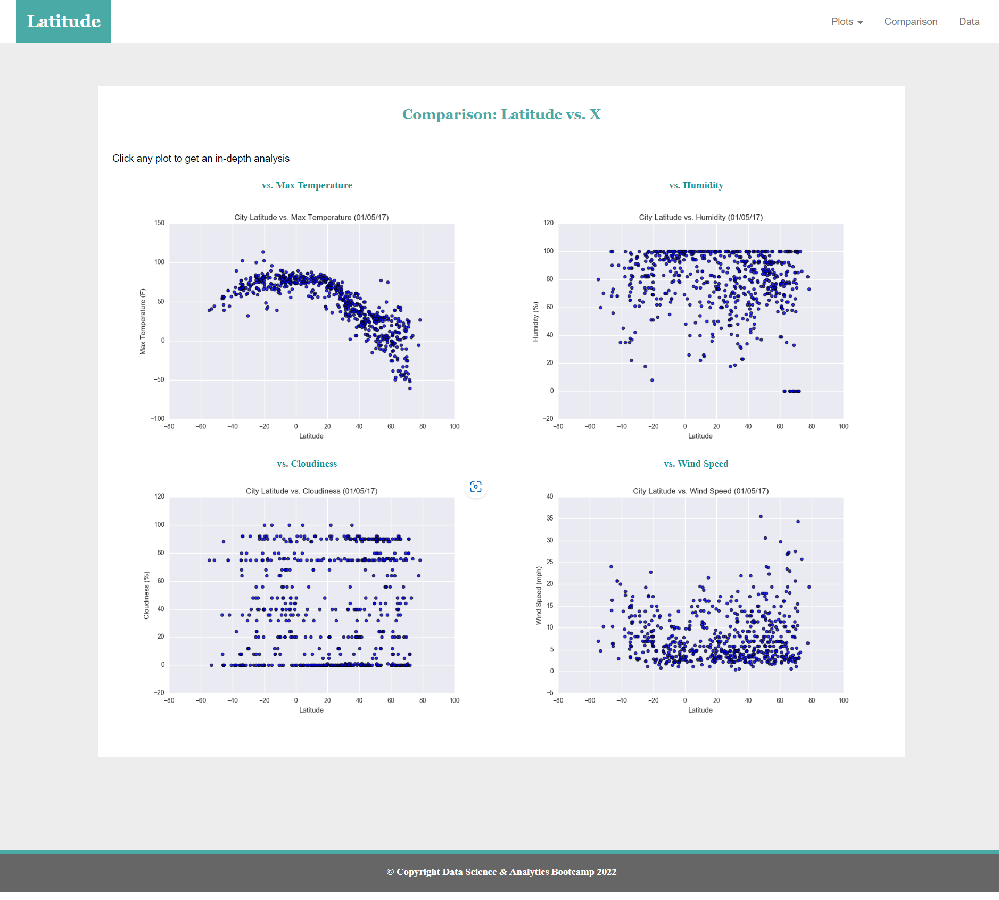

# Web-Design-Challenge

## Background

HTML, CSS, and Bootstrap were used in this project to create a website by using visualizations that were created in the Python-APIs project.

### Website Details

The website created with seven pages in total, including:

* A Landing page - `index.HTML` containing the following elements:

  * An explanation of the project

  * Links to each visualizations page. There should be a sidebar containing preview images of each plot. Clicking an image will take the user to that visualization.

* Four `visualization pages` stored in the `visualizations` folder, each with the following elements:

  * A descriptive title and heading tag.

  * The plot or visualization for the selected comparison (latitude vs: max temperature, humidity, cloudiness, or wind speed). The images displayed on these pages are stored in the `assets/images` folder.

  * A paragraph describing the plot and its significance.

* A `Comparisons` page that does the following:

  * Contains all of the visualizations on the same page so they can easily be compared with each other.

  * Uses a Bootstrap grid for the visualizations.

    * The grid has two visualizations across medium and large screens, and it has one visualization across on extra-small or small screens.

* A `Data` page] that displays a responsive table containing the data used in the visualizations.

  * The table used is a Bootstrap table component. 

  
  
At the top of every page, the website has a navigation menu with the following elements:

* It has the name of the site on the left of the navigation bar, allowing users to return to the landing page from any page.

* It contains a dropdown menu on the right of the navigation bar, named "Plots," to provide links to each individual visualization page.

* It provides two more text links on the right: "Comparisons," which links to the comparisons page, and "Data," which links to the data page.

Finally, the website is deployed to GitHub  with the website working on a live, publicly accessible URL.
